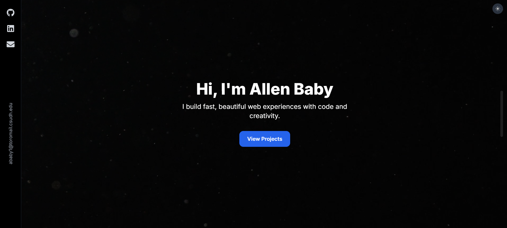

# 🧑‍💻 Personal Developer Portfolio

This is my personal developer portfolio website, built with **Next.js 15**, **Tailwind CSS**, and **GSAP animations**. It showcases my projects, technical stack, and development experience in a sleek, performant interface that I personally love. 
The smooth scrolling is so satisfying xD.



---

## 🚀 Features

- ✨ Built with **Next.js 15**
- 🎨 Styled using **Tailwind CSS**
- 📦 Animations via **GSAP** and **ScrollTrigger**
- ⚙️ Fully responsive and mobile-friendly
- 💡 Modular, reusable components
- 🧠 SEO-friendly metadata with dynamic `<head>` management
- 📁 File-based routing and layout system
- 🌐 Hosted on [Vercel](https://vercel.com/)

---

## 🛠️ Tech Stack

- **Framework**: Next.js (App Router)
- **Styling**: Tailwind CSS
- **Animation**: GSAP
- **Icons**: React Icons / Custom SVGs
- **Type Checking**: TypeScript
- **Deployment**: Vercel

---

## 📂 Project Structure

```
.
├── public/                  # Static assets (favicon, images, etc.)
├── src/
│   ├── app/                 # App Router pages and layouts
│   ├── components/          # Reusable UI components
│   ├── context/             # Context providers
│   └── utils/               # Utility functions and constants
├── .gitignore
├── README.md
├── package.json
├── package-lock.json
├── tailwind.config.ts
├── tsconfig.json
├── next.config.ts
├── postcss.config.mjs
└── eslint.config.mjs
```

---

## 🖥️ Getting Started

### 1. Clone the repository

```bash
git clone https://github.com/allenbaby/portfolio
cd portfolio
```

### 2. Install dependencies

```bash
npm install
```

### 3. Run in development

```bash
npm run dev
```

### 4. Build for production

```bash
npm run build
npm run start
```

---

## 🌐 Deployment

The project is deployed using [**Vercel**](https://vercel.com/).

---


---

---

## 🙋‍♀️ Author

Built with ❤️ by [Allen Baby](https://www.linkedin.com/in/allenbaby/) 
